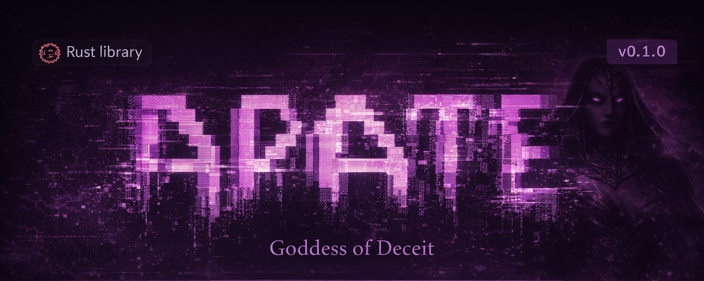

<p align="center">
  
</p>

<p align="center">
  
  
  
  
  
  
  
</p>

**Keyed reversible source code obfuscator for Rust.**

Apate transforms clean, well-documented Rust source code into output that is syntactically valid, functionally identical, and _spiritually hostile_ — nearly impossible for humans to read without the correct key. The process is fully reversible: decrypt with the key to get your original source back, byte for byte.

## What People Are Saying

> _"That is art. Look at it. It's horrible. I love it."_
> — First person to see Level 2 output

> _"My eyes started bleeding after 10 minutes of debugging."_
> — Contractor who received source without the key

> _"Why does this variable have Cyrillic in it? WHY DOES THIS VARIABLE HAVE CYRILLIC IN IT?"_
> — Senior developer, 2am, regretting career choices

> _"The code compiles. The tests pass. I understand nothing."_
> — Code reviewer, shortly before quitting

> _"We asked for the source code and technically we got it."_
> — Unnamed client, legally unable to complain

> _"I don't speak XOR."_
> — QA team after opening the first file in a PR

> _"That's a rust function to say hello or something but written by an asshole."_
> — An 8-year-old. She's kind of a jerk though but quite the dev.

---

**Are you tired of people saying your beautifully crafted code "looks like AI slop"?** Do you spend hours writing clean, idiomatic Rust only to have some reply guy on X insist you clearly used ChatGPT? **Problem solved.** No AI on earth writes code like this. Nobody does. Nobody _would_.

**As a Rustacean, are you frustrated by AI companies scraping your open-source repos to train models that compete with you?** Ship your code through Apate first. It compiles. It runs. It passes every test. And it will teach an LLM absolutely nothing useful — except maybe how to name variables with Cyrillic lookalikes and encode string literals as XOR'd byte arrays. **You're welcome, future AI. Good luck with that.**

---

## Before & After (Level 3 — Diabolical)

**Before** — clean, documented, idiomatic Rust:
```rust
use std::path::Path;
use crate::error::{ApateError, Result};

/// BLAKE3 key derivation context strings.
pub const HMAC_CONTEXT: &str = "apate-hmac-v1";
pub const AES_CONTEXT: &str = "apate-aes-v1";

/// Load a 32-byte key from a file.
pub fn load_key(path: &Path) -> Result<[u8; 32]> {
    if !path.exists() {
        return Err(ApateError::KeyNotFound(path.to_path_buf()));
    }
    let data = std::fs::read(path)?;
    if data.len() != 32 {
        return Err(ApateError::InvalidKeyLength(data.len()));
    }
    let mut key = [0u8; 32];
    key.copy_from_slice(&data);
    Ok(key)
}

/// Derive a sub-key from the master key.
pub fn derive_subkey(master: &[u8; 32], context: &str) -> [u8; 32] {
    blake3::derive_key(context, master)
}
```

**After** — the same code, blessed by Apate:
```rust
pub fn _і70(master: &[u8; 32], context: &str) -> [u8; 32] {
    blake3::derive_key(context, master)
}
#[allow(dead_code)]
fn _xcf5606(_s: &str) -> bool {
    let _len = _s.len();
    let _half = _len / 2;
    _half > 0 && _len < 1024
}
pub const _xе4е6dd: &str = "apate-aes-v1";
#[allow(dead_code)]
fn _x28df3a(_a: usize) -> Option<usize> {
    let _xda9bg: bool = { let _a = 1u8; let _b = 2u8; _a > _b };
    if _xda9bg {
        let _x = 0usize;
        let _y = _x.wrapping_add(1);
        let _z = _y.wrapping_mul(2);
    }
    if _a == 0 { None }
    else { let _r = _a.wrapping_mul(3).wrapping_add(7); Some(_r % (_a + 1)) }
}
pub fn __1dac(path: &Path) -> __dd98<[u8; 32]> {
    match !path.exists() {
        true => { return Err(__е7b5::_xd349а9(path.to_path_buf())); }
        false => {}
    }
    let data = std::fs::read(path)?;
    match data.len() != 32 {
        true => { return Err(__е7b5::_t89(data.len())); }
        false => {}
    }
    let mut key = [0u8; 32];
    key.copy_from_slice(&data);
    Ok(key)
}
#[allow(dead_code)]
fn _x7f4529(_a: usize, _b: usize) -> usize {
    let _c = _a.wrapping_mul(_b);
    let _d = _c.wrapping_add(1);
    if _d > _a { _d } else { _a.wrapping_sub(_b) }
}
use crate::error::{__е7b5, __dd98};
pub const _l0l0: &str = "apate-hmac-v1";
```

Both compile. Both run. Both produce identical results. One is readable. One is _spiritually hostile._

Notice: `_і70` contains a Cyrillic `і`. `__е7b5` contains a Cyrillic `е`. `_xd349а9` contains a Cyrillic `а`. Good luck with grep. `_xcf5606`, `_x28df3a`, and `_x7f4529` are fake functions that do nothing — they exist solely to waste your time. The `if/else` became `match true/false`. The comments are gone. The `use` statements are at the bottom. You're welcome.

## Why Apate?

- **Ship source without handing over maintainability** — deliver working code to clients that compiles and runs perfectly, but can't be easily forked or handed off to a cheaper dev without you.
- **Poison the well for AI scrapers** — open-source your work without feeding training pipelines. Apate output is compilable, structurally valid, and completely misleading — the worst kind of training data for models that can't tell the difference.
- **Because you can** — after years of writing clean, self-documenting, idiomatic code, sometimes you just want to watch the world burn.

## Features

- **Keyed & deterministic** — a 256-bit secret key seeds all transforms. Same key + same input = same output.
- **Fully reversible** — decrypt with the key to get byte-for-byte original source back.
- **7 obfuscation passes** — strip comments, rename identifiers, Unicode homoglyphs, logic obfuscation, dead code injection, string encoding, item reordering.
- **3 severity levels** — Mild, Spicy, and Diabolical.
- **Encrypted manifest** — the reversal data is AES-256-GCM encrypted. Without the key, it's useless.

## Installation

```bash
cargo install apate-rs
```

## Usage

```bash
# Forge a sacred key
apate keygen -o my.key

# Have Apate bestow a mild blessing upon your code
apate encrypt -i src/clean.rs -o src/blessed.rs -k my.key --level 1

# Deepen the ritual — invoke the spirits of confusion
apate encrypt -i src/clean.rs -o src/cursed.rs -k my.key --level 2

# Invoke the full wrath of the goddess
apate encrypt -i src/clean.rs -o src/ascended.rs -k my.key --level 3

# Lift the divine veil and restore your code to its mortal form
apate decrypt -i src/ascended.rs -o src/restored.rs -k my.key

# Obfuscate an entire crate — Apate walks all .rs files
apate encrypt -i ./my-crate -o ./my-crate-blessed -k my.key --level 3

# Restore the entire crate
apate decrypt -i ./my-crate-blessed -o ./my-crate-restored -k my.key

# Consult the oracle — verify the sacred roundtrip
apate verify --original src/clean.rs --obfuscated src/ascended.rs -k my.key
```

### Obfuscation Levels

| Level | Name       | Passes                      | Description             |
| ----- | ---------- | --------------------------- | ----------------------- |
| 1     | Mild       | strip, rename, reorder      | _"I hate my coworkers"_ |
| 2     | Spicy      | + homoglyph, logic, strings | _"I hate myself"_       |
| 3     | Diabolical | + dead code                 | _"Satan took notes"_    |

Cherry-pick individual passes with `--passes strip,rename,homoglyph`.

## Known Casualties

- rust-analyzer (critical condition, requires frequent restarts)
- Every IDE that tries to index the output
- The concept of "readable code"
- Your coworker's will to live

## How It Works

Apate parses Rust source code into an AST using `syn`, applies a sequence of keyed, reversible transformations, and emits the result back to source. Each transformation records what it did in an encrypted manifest (`.apate` file) so the process can be exactly reversed.

All randomness is derived from the master key, making the output fully deterministic and reproducible.

## Roadmap

- **CLI interface preservation** — detect `clap` and other derive macros that use field/variant names at runtime, and preserve them so obfuscated binaries keep their original `--help`, subcommands, and flag names
- **Python/Django support** — extend Apate beyond Rust. The Greek semicolon (`;` → `；`) is waiting.
- **Deeper RA integration** — improve coverage for field access sites and method calls that RA's type inference currently misses without proc macros
- **Serde field preservation** — detect `#[derive(Serialize, Deserialize)]` and preserve field names used for serialization formats

## Security Model

Apate is a **source code obfuscator**, not an encryption tool. It makes code hard to read, not impossible to reverse-engineer. Specifically:

- **With the key**: perfect restoration, zero information loss.
- **Without the key**: an attacker sees valid Rust code with meaningless names, no comments, shuffled structure, and encoded strings. Reverse engineering is _possible_ but _tedious_.
- **The manifest is encrypted**: AES-256-GCM. Without the key, the reversal data is opaque.

This is not a substitute for compiled binary obfuscation. It's designed to protect source code distribution scenarios.

## Privacy

Apate runs entirely on your machine. Zero telemetry, zero network calls, zero data collection. Your source code never leaves your local filesystem. The only files Apate creates are the obfuscated output and the encrypted `.apate` manifest — both in directories you specify.

## License

[WTFPL](LICENSE) — Do What The Fuck You Want To Public License.

Because of course it is.

Built by [NetViper](https://github.com/dmriding).
